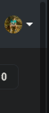

<h1 align="center">
</img> 
</img>
</h1>

    <a href="https://github.com/nicolas-oliveira/make-scrollbars-great-again/tags/">
        </img>
    </a>

# About

MakeScrollGreatAgain is a simple hack extension for Chrome/Chromium and Opera that replace the old and ugly scrollbar with OverlayScrollBar

<table>
    <tr>
        <th>Before</th>
        <th>After</th>
    </tr>
    <tr>
        <th></img></th>
        <th></img></th>
    </tr>
</table>

### How to install
To test, just clone this repository and run the extension in your browser with the corresponding folder. You may need to activate the developer mode to Load without packing

### Reference

This repository is based in [OverlayScrollbars](https://github.com/KingSora/OverlayScrollbars)
